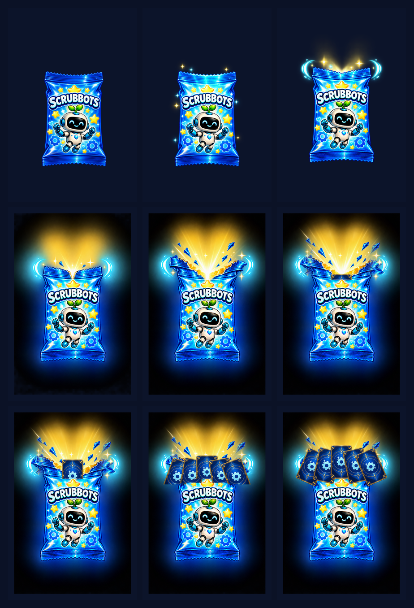
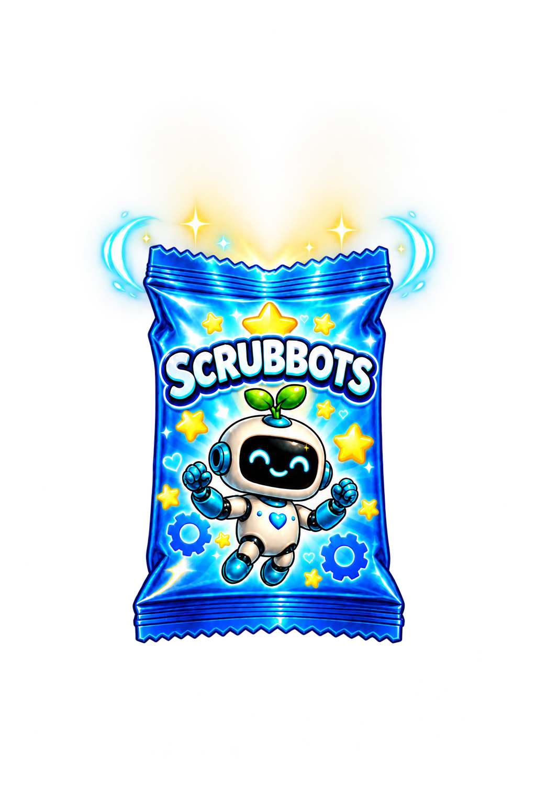
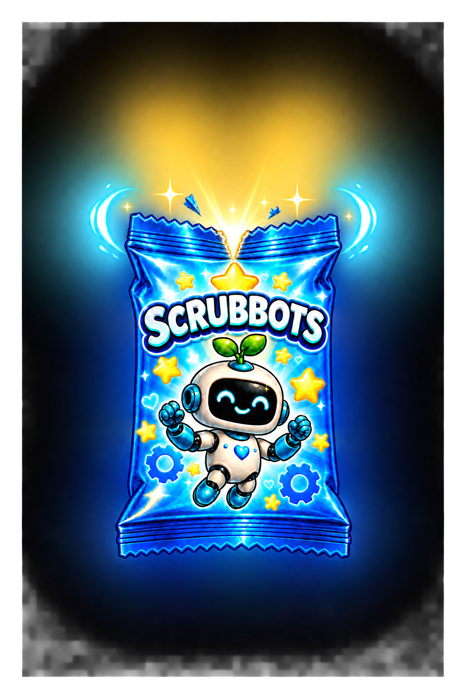
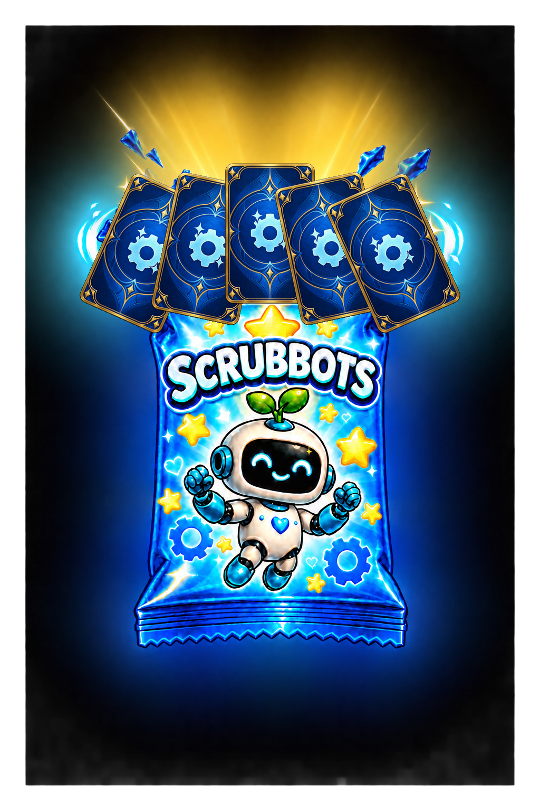
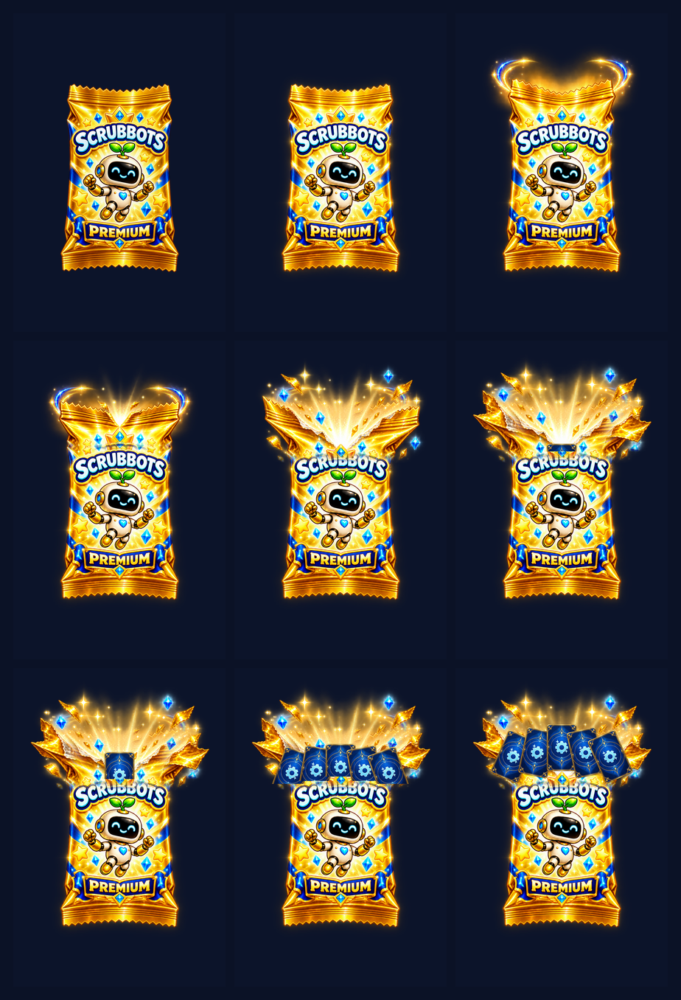

# Owner Pack Asset Review V01

Status: **AWAITING OWNER REVIEW — not self-approved**

Task: SB-M43-076 / M43-C005-C002. These are review-only candidate assets; no production pack asset or runtime scene/script was changed.

## Owner source references

- Standard: [owner source PNG](references/owner_standard_pack.png) — 1269×1240 RGBA; file SHA-256 `876b874938a1123288233712015b485c714c99116dc50c2d6085474c92944baa`; decoded RGBA-pixel SHA-256 `37bbe0f1d09260e4c4b26356c8986aa65f96fb81ad2aee9f8a3533761d9f191f`.
- Premium: [owner source PNG](references/owner_premium_pack.png) — 1024×1536 RGBA; file SHA-256 `51b4e7c85bf4ca9358e5f3c6c3afe0c551ee34c27c25d3a48c151ab4cb821faf`; decoded RGBA-pixel SHA-256 `074256759938dc1e662441d2fc5b7e3b84ec289cd066c518089595ac6f7f0d6e`.

V02 states the attachment PNG hashes are informational and authorizes a sole named local file when it is visibly the approved pack. The owner reconfirmed these exact local images as the Standard and Premium main visuals in this chat.

## Standard contact sheet

### Standard frames

#### Standard 01 — Closed / idle

#### Standard 02 — Charge / light buildup

#### Standard 03 — Shake / pressure

#### Standard 04 — First tear

#### Standard 05 — Tear widens

#### Standard 06 — Full open / one card edge

#### Standard 07 — One card rises

#### Standard 08 — Three cards emerge

#### Standard 09 — Final three-card reveal

## Premium contact sheet

### Premium frames

#### Premium 01 — Closed / idle

#### Premium 02 — Charge / light buildup

#### Premium 03 — Shake / pressure

#### Premium 04 — First tear

#### Premium 05 — Tear widens

#### Premium 06 — Full open / one card edge

#### Premium 07 — One card rises

#### Premium 08 — Five cards emerge

#### Premium 09 — Final five-card reveal

## Owner decision

Please answer these five visual questions:

1. Standard identity + opening motion OK?
2. Standard 3-card final fan OK?
3. Premium identity + opening motion OK?
4. Premium 5-card final fan OK?
5. Glow/fragment intensity OK?
